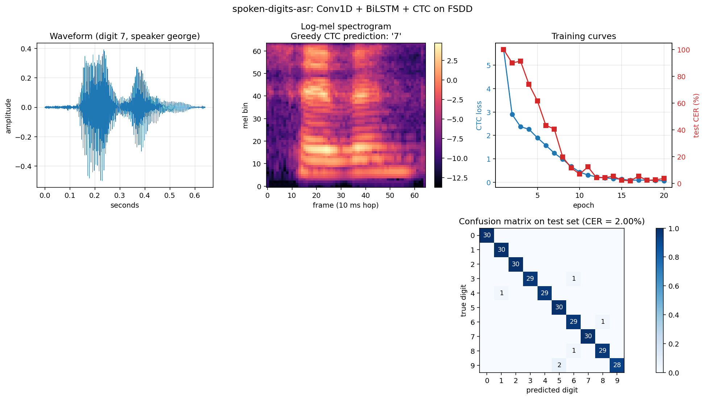
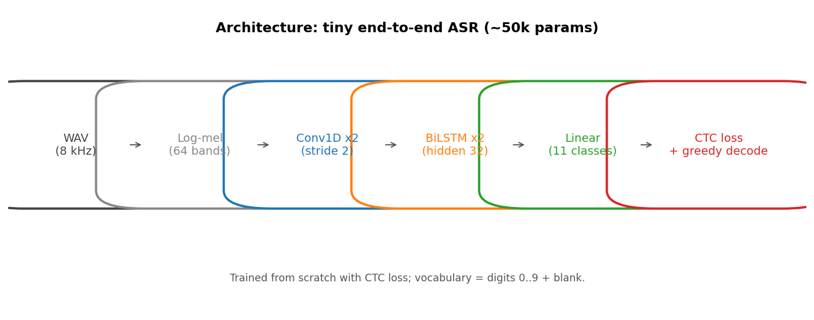

# spoken-digits-asr

A tiny CTC speech recognizer trained from scratch on the Free Spoken Digit Dataset.

  



## What it does

Takes a one-second WAV recording of a spoken digit (0..9) and transcribes it. The whole pipeline is a single neural network with a CTC loss, trained end-to-end on roughly 3,000 utterances in about 90 seconds on a laptop CPU.

## Why it matters

Production speech recognizers (Whisper, Conformer, USM) feel magical. This repo unpacks the magic: it shows that an end-to-end ASR system is just **mel features -> a sequence encoder -> a CTC head**. Once you have built and trained one yourself at this scale, the architecture of large models stops being mysterious.

> ### Looking for production-grade ASR?
> For real-world French ASR, see my fine-tuned Whisper Large V3 Turbo on Hugging Face: [Mathos34400/whisper-large-v3-turbo-french-v6](https://huggingface.co/Mathos34400/whisper-large-v3-turbo-french-v6). Sixth iteration of the recipe, fine-tuned on French speech corpora and optimized for low-latency inference.

## How it works

- **Features**: 64-band log-mel spectrograms, 25 ms window, 10 ms hop, computed on the fly with `torchaudio`.
- **Encoder**: two Conv1D layers (kernel 5, stride 2) downsample the time axis 4x, followed by two BiLSTM layers (hidden 32 per direction).
- **Head**: linear projection to 11 classes (digits 0..9 + CTC blank).
- **Loss**: `torch.nn.CTCLoss` over (T', batch, 11) log-probabilities.
- **Decoding**: greedy CTC (collapse consecutive duplicates, drop blanks).

The Free Spoken Digit Dataset (FSDD) splits utterances by index: indices 0..4 of each (digit, speaker) pair go to the test set, 5..49 to train. We follow that convention.

## Architecture



## Quickstart

```bash
git clone https://github.com/Mathos34/spoken-digits-asr
cd spoken-digits-asr
python -m venv .venv && source .venv/bin/activate   # or .venv\Scripts\activate on Windows
pip install -r requirements.txt
python scripts/download.py     # ~50 MB clone of FSDD
python train.py
python scripts/make_viz.py
```

End-to-end run (download + 20 epochs + viz) is about 2 minutes on a laptop CPU.

## Results

Trained for 20 epochs, batch 32, Adam lr 1e-3. Best checkpoint is the one with the lowest test CER across epochs.

| Metric | Value |
|---|---|
| Best test character error rate (CER) | **2.00%** |
| Exact-utterance accuracy on test set | **98.0%** |
| Model parameters | 91,979 |
| Train / Test split | 2,700 / 300 utterances |
| Training time (CPU) | ~60 s |

Final-epoch CER fluctuates between 2 and 5%, typical behavior on a small dataset; we keep the best checkpoint.

## References

- Graves et al., *Connectionist Temporal Classification*, ICML 2006.
- Radford et al., *Robust Speech Recognition via Large-Scale Weak Supervision* (Whisper), 2022.
- Free Spoken Digit Dataset: https://github.com/Jakobovski/free-spoken-digit-dataset

## About

Built by Mathis Lacombe, AI Maker at the [Intelligence Lab](https://www.ece.fr/intelligence-lab/), ECE Paris.
[LinkedIn](https://www.linkedin.com/in/mathis-lacombe34/) · [Hugging Face](https://huggingface.co/Mathos34400)
